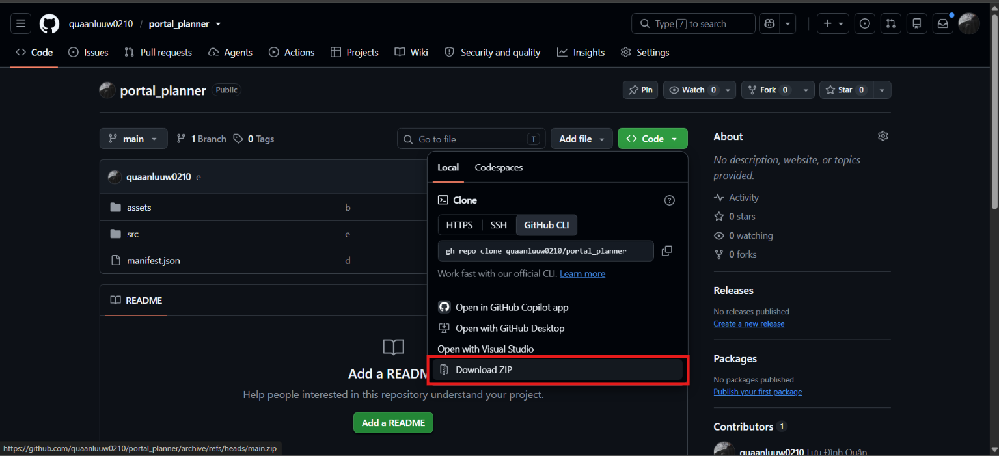
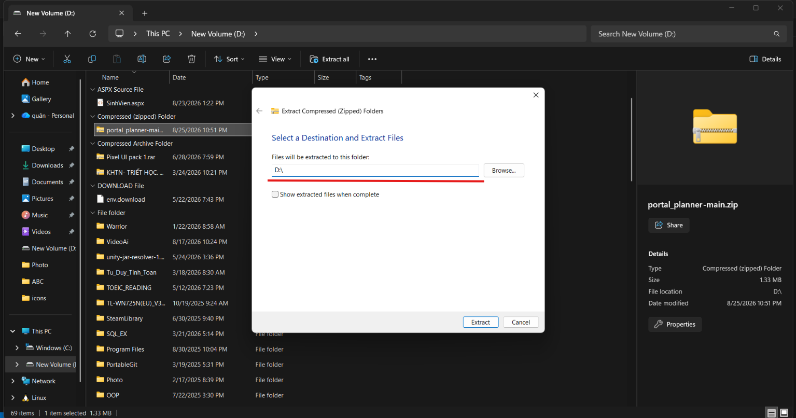
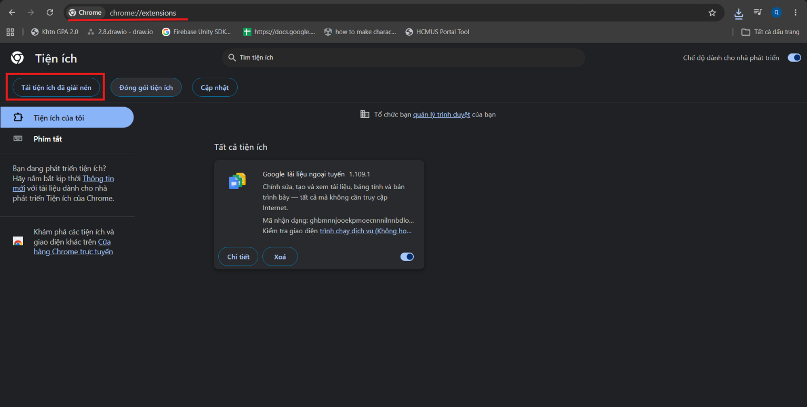
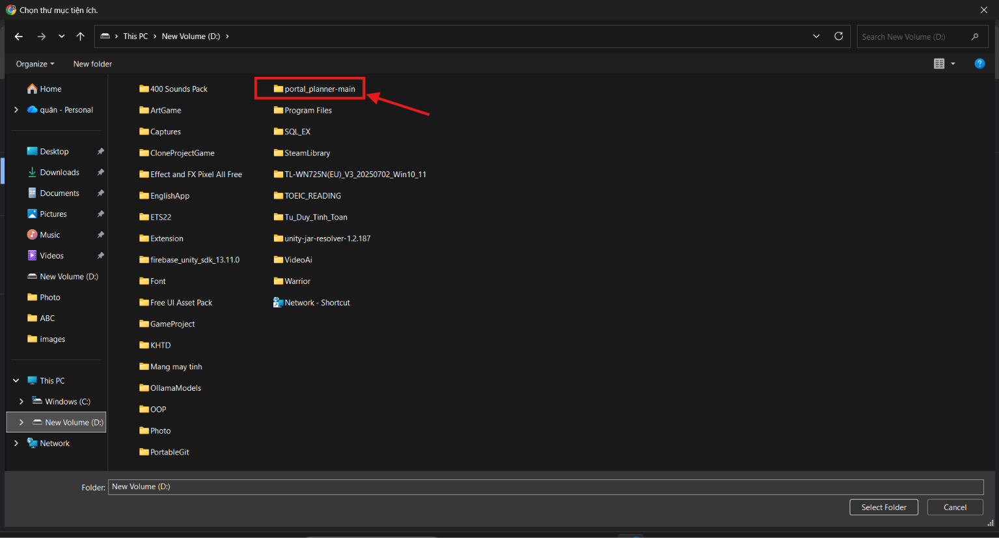
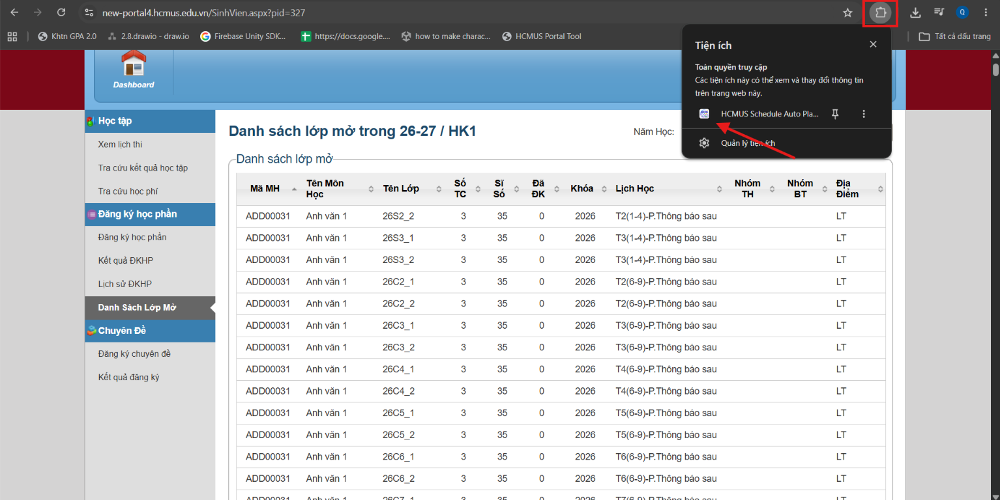
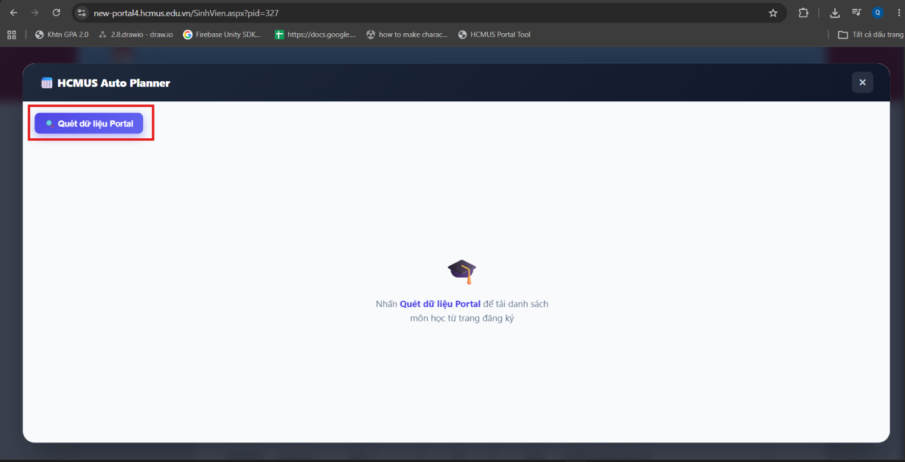

# 🚀 HCMUS Schedule Auto Planner - Tiện ích Xếp Thời Khóa Biểu Tự Động

Tiện ích hỗ trợ sinh viên tự động trích xuất danh sách lớp mở trên Portal, mô phỏng và tự động sắp xếp các phương án Thời Khóa Biểu tối ưu, không lo trùng giờ.

---

## 🛠️ Hướng dẫn Cài đặt & Sử dụng (Bản Dùng Thử / Dev)

### 📌 Bước 1: Tải file Zip từ GitHub
Truy cập vào trang GitHub của dự án, bấm vào nút **Code** màu xanh $\rightarrow$ Chọn **Download ZIP** để tải source code về máy.

---

### 📌 Bước 2: Giải nén thư mục
Giải nén file `.zip` vừa tải về. 

> ⚠️ **LƯU Ý QUAN TRỌNG:** Nên giải nén trực tiếp ra ổ đĩa (ví dụ: `D:\HCMUS-Schedule-Planner`) hoặc thư mục ngắn để tránh bị lỗi **lồng tầng thư mục** (`D:\folder\folder\...`).

---

### 📌 Bước 3: Mở trang quản lý Chrome Extension
1. Mở trình duyệt Google Chrome (hoặc Cốc Cốc, Brave, Edge).
2. Truy cập đường dẫn `chrome://extensions/` trên thanh địa chỉ.
3. Bật **Chế độ dành cho nhà phát triển (Developer mode)** ở góc trên bên phải.
4. Nhấn vào nút **Tải tiện ích đã giải nén (Load unpacked)**.

---

### 📌 Bước 4: Chọn thư mục Extension
Tìm đến đúng thư mục chứa dự án mà bạn đã giải nén ở **Bước 2** và chọn **Select Folder**.

---

### 📌 Bước 5: Kích hoạt Extension trên trang Portal
1. Truy cập vào trang **Danh sách lớp mở** trên Portal trường như bình thường.
2. Nhấp vào biểu tượng **Logo Extension** trên thanh công cụ trình duyệt (hoặc trong menu mảnh ghép 🧩).

---

### 📌 Bước 6: Quét dữ liệu và Tận hưởng!
Bấm vào nút **"Quét dữ liệu"** (hoặc Bắt đầu mô phỏng). Extension sẽ tự động đọc danh sách môn học, lọc trùng lịch và đưa ra các phương án TKB tối ưu nhất cho bạn! 🎉

---
